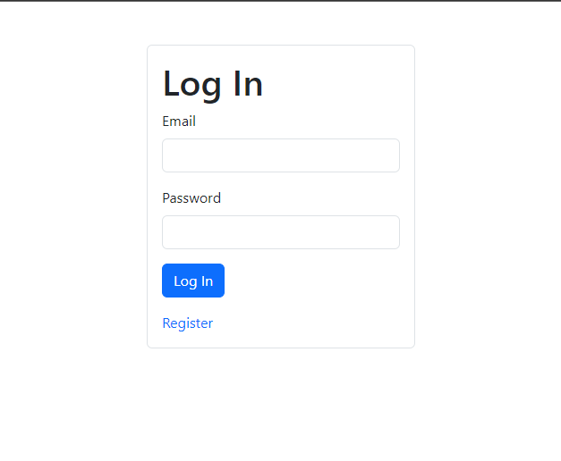
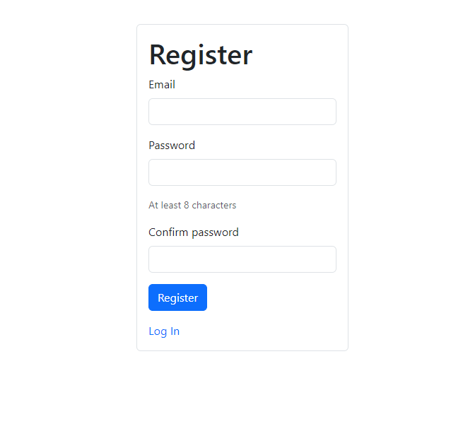
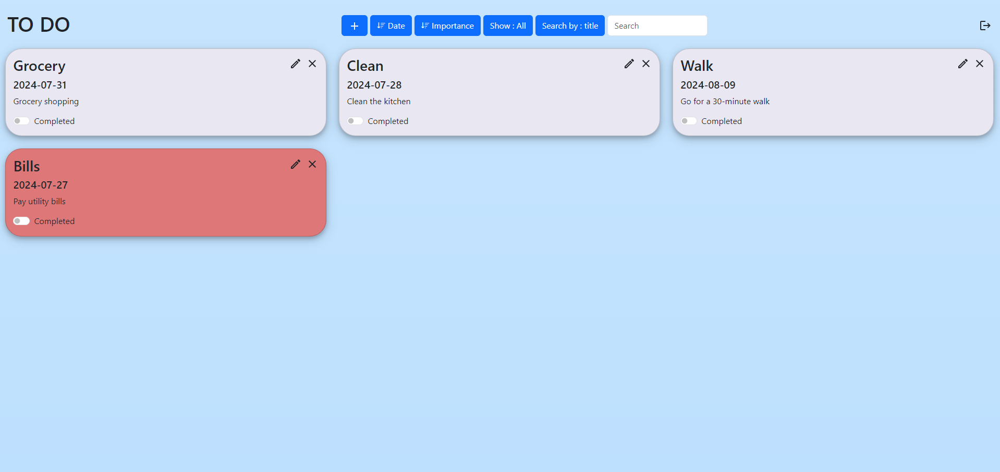
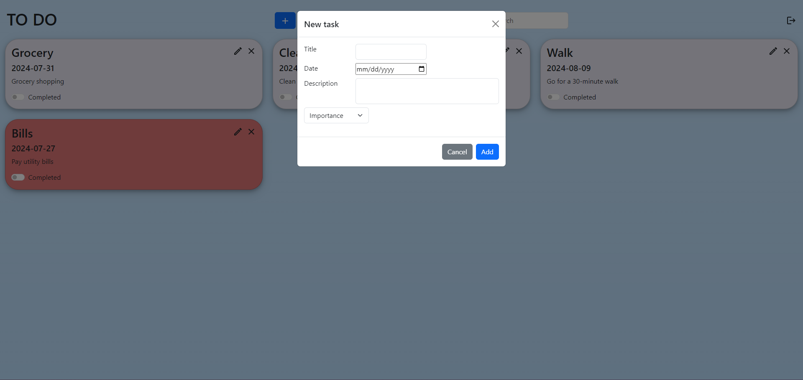

# Fullstack Todo App

## Table of Contents
- [Fullstack Todo App](#fullstack-todo-app)
  - [Table of Contents](#table-of-contents)
  - [Introduction](#introduction)
  - [Features](#features)
  - [Technologies Used](#technologies-used)
  - [Installation](#installation)
  - [Screenshots](#screenshots)
  - [Live Demo](#live-demo)

## Introduction
The MERN Todo App is a simple and intuitive task management application built using the MERN stack (MongoDB, Express.js, React.js, Node.js). It allows users to create, read, update, and delete tasks.

## Features
- User authentication and authorization
- Create, read, update, and delete tasks
- Mark tasks as complete or incomplete
- Filter and sort tasks

## Technologies Used
- **Frontend:** React.js, Vite, CSS, Bootstrap
- **Backend:** Node.js, Express.js
- **Database:** MongoDB
- **Authentication:** JWT (JSON Web Tokens)
- **Deployment:** Netlify (Frontend) and Railway (Backend)

## Installation
To run this project locally, follow these steps:

1. Clone the repository:
   ```bash
   git clone https://github.com/SamuArg/fullstack-todo.git
   cd fullstack-todo

2. Install backend dependencies:
   ```bash
   cd server
   npm install
   ```

3. Set up environment variables:
   
   Create a `.env` file in the `server` directory and add the following:
   ```bash
   MONGO_URI=your_mongodb_connection_string
   SECRET=your_jwt_secret
   PORT=your_port
   ```

4. Start the dev backend server:
   ```bash
   npm dev
   ```

5. Install frontend dependencies:
   Open a new terminal, navigate to the `fullstack-todo` directory, and run:
   ```bash
   cd client
   npm install
   ```

6. Go to config.js and change the API_URL to your backend API
   ```bash
   cd src/api
   ```
7. Start the frontend development server:
   ```bash
   npm run dev
   ```
   It will launch the client on `http://localhost:3000`.

## Screenshots
Here are some screenshots of the application:


*Login Page*


*Register page*


*Todo List*


*Add Todo*

## Live Demo
Check out the live demo [here](https://samuarg-todo.netlify.app/).